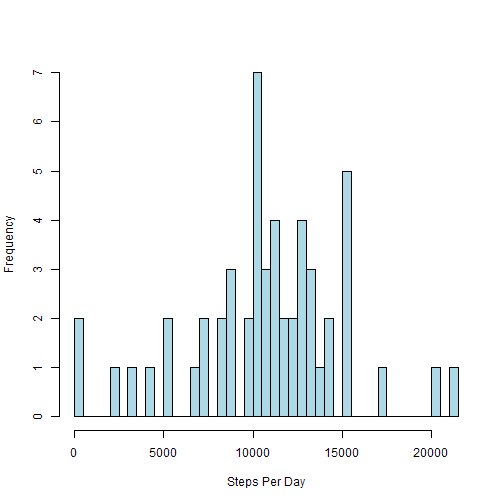

# Reproducible Research: Peer Assessment 1


## Loading and preprocessing the data

```r
unzip("activity.zip")

activityDF <- read.csv("activity.csv")
```


## What is mean total number of steps taken per day?

Make a histogram of the total number of steps taken each day

```r
stepsPerDay <- aggregate(steps ~ date, data = activityDF, FUN = sum)

hist(stepsPerDay$steps, breaks = nrow(stepsPerDay), main = "", xlab = "Steps Per Day", 
    ylab = "Frequency", col = "lightblue")
```

 


Calculate and report the mean and median total number of steps taken per day

```r
meanStepsPerDay <- mean(stepsPerDay$steps)
medianStepsPerDay <- median(stepsPerDay$steps)
```


Mean number of steps taken per day: 1.0766 &times; 10<sup>4</sup>
Median number of steps taken per day: 10765

## What is the average daily activity pattern?


## Imputing missing values


## Are there differences in activity patterns between weekdays and weekends?
