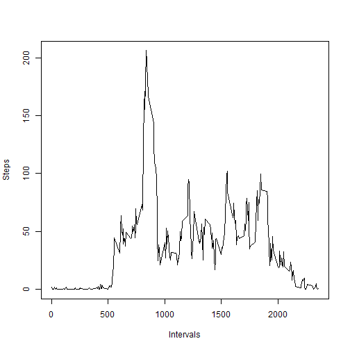
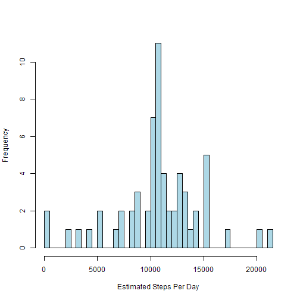

# Reproducible Research: Peer Assessment 1


## Loading and preprocessing the data

```r
unzip("activity.zip")

activityDF <- read.csv("activity.csv")
```


## What is mean total number of steps taken per day?

Make a histogram of the total number of steps taken each day

```r
stepsPerDay <- aggregate(steps ~ date, data = activityDF, FUN = sum)

hist(stepsPerDay$steps, breaks = nrow(stepsPerDay), main = "", xlab = "Steps Per Day", 
    ylab = "Frequency", col = "lightblue")
```

 


Calculate and report the mean and median total number of steps taken per day

```r
meanStepsPerDay <- mean(stepsPerDay$steps)
medianStepsPerDay <- median(stepsPerDay$steps)
```


Mean number of steps taken per day: 10766

Median number of steps taken per day: 10765

## What is the average daily activity pattern?

Make a time series plot (i.e. type = "l") of the 5-minute interval (x-axis) and the average number of steps taken, averaged across all days (y-axis)

```r
avg5Min <- aggregate(steps ~ interval, data = activityDF, FUN = mean)

plot(avg5Min, type = "l", xlab = "Intervals", ylab = "Steps")
```

 


Which 5-minute interval, on average across all the days in the dataset, contains the maximum number of steps?

```r
maxInterval <- avg5Min[which.max(avg5Min$steps), "interval"]
```


Interval with the maximum number of steps: 835

## Imputing missing values

Calculate and report the total number of missing values in the dataset (i.e. the total number of rows with NAs)

```r
totalNA <- sum(is.na(activityDF))
```


Total missing values: 2304

Create a new dataset that is equal to the original dataset but with the missing data filled in.

```r
# Using 5 minute means
completeDF <- merge(activityDF, avg5Min, by = "interval", suffixes = c("", ".int"))

naList <- is.na(completeDF$steps)
completeDF$steps[naList] <- completeDF$steps.int[naList]  #

completeDF <- completeDF[, c(1:3)]
```


Make a histogram of the total number of steps taken each day and Calculate and report the mean and median total number of steps taken per day. Do these values differ from the estimates from the first part of the assignment? What is the impact of imputing missing data on the estimates of the total daily number of steps?

```r
compStepsPerDay <- aggregate(steps ~ date, data = completeDF, FUN = sum)

hist(compStepsPerDay$steps, breaks = nrow(compStepsPerDay), main = "", xlab = "Estimated Steps Per Day", 
    ylab = "Frequency", col = "lightblue")
```

 

```r

cMeanStepsPerDay <- mean(compStepsPerDay$steps)
cMedianStepsPerDay <- median(compStepsPerDay$steps)
```


Mean number of steps taken per day: 10766

Median number of steps taken per day: 10766

There does not appear to be large difference in the estimate and the median is only very slightly higher.


## Are there differences in activity patterns between weekdays and weekends?
